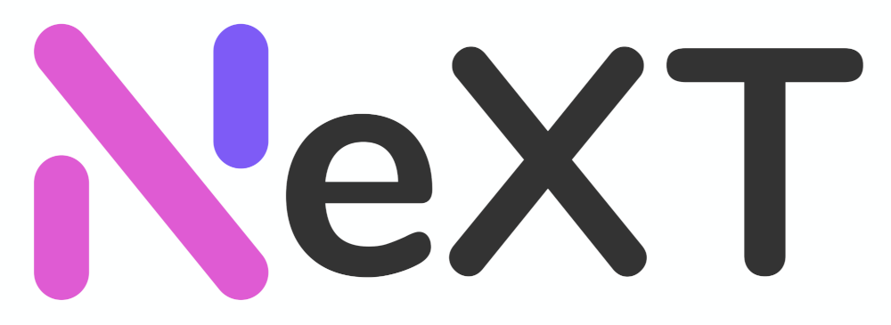

## TL;DR

NeXT Panel is a multipurpose proxy service management system designed for Shadowsocks(2022) / Vmess / Trojan / TUIC protocol.

## Features

- Integrate multiple payment systems such as Alipay F2F, PayPal, Stripe, etc.
- Support multiple mail services, built-in mail queue function, no third-party components are required to use
- Built-in tabler theme based on Bootstrap 5, Smarty/Twig template engine support
- Support Shadowsocks 2022, TUIC, and other latest proxy protocols
- Universal subscription interface, one-click json/clash/sip008/sing-box format subscription distribution
- Custom node configuration, modular subscription system, support multiple client-specific subscription formats
- Refactored store system, support billing modes including but not limited to annual/monthly, pay-as-you-go, access type billing, etc.
- Refactored scheduled task system, one command can automatically complete all scheduled tasks
- Deep integration of large language models, support intelligent replies to tickets, document generation, and other functions
- One-click access to OpenAI, Google AI, Vertex AI, Hugging Face Hosted API, Cloudflare Workers AI, Anthropic, and other large language model services

## Installation

NeXT Panel requires the following programs to be installed and run normally:

- Git
- Nginx（HTTPS configured）
- PHP 8.2+ （OPcache+JIT enabled）
- PHP Redis extension 6.0+
- MariaDB 10.11+（Disable strict mode）
- Redis 7.0+

## Ecosystem

- [NeXT Server](https://github.com/SSPanel-NeXT/NeXT-Server)
- NeXT Desktop(WiP)
- [NetStatus-API-Go](https://github.com/SSPanel-NeXT/NetStatus-API-Go)

## Documentation

[NeXT Panel Docs](https://docs.sspanel.org)

## Support Developers

Sadly, there is no three-letter agency that wants to sponsor this project yet (/s), so the development is driven by the community and unpaid volunteers.
Nothing will be put behind the paywall or require a donation to use, but the CI/Linux Mirror/CDN server doesn't grow on trees, if you are interested in supporting the project, you can support devs using the following methods:

<a href="https://www.patreon.com/catdev">Patreon (One time or monthly)</a>

<a href="https://www.vultr.com/?ref=8941355-8H">Vultr Ref Link</a>

<a href="https://www.digitalocean.com/?refcode=50f1a3b6244c">DigitalOcean Ref Link</a>

## License

[MIT License](blob/dev/LICENSE)
